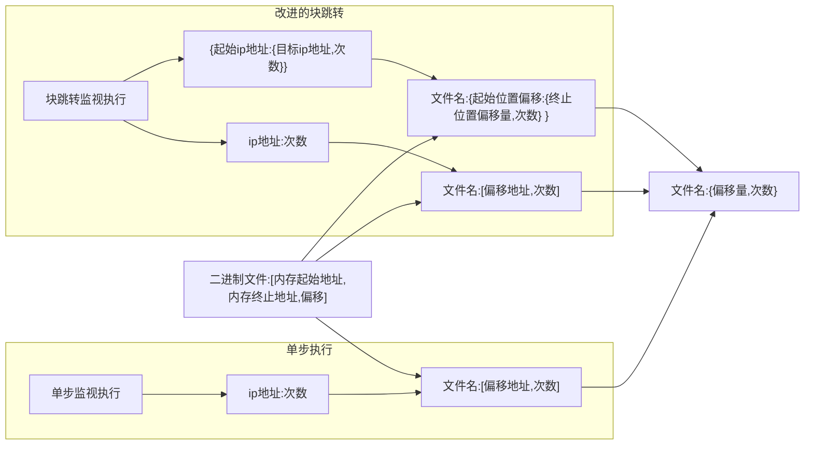

```mermaid
graph LR;

fmaps["二进制文件:[内存起始地址,内存终止地址,偏移]"]

subgraph 单步执行
    sp[单步监视执行]
    tmpss["ip地址:次数"]
    tmpssx["文件名:[偏移地址,次数]"]

    sp --> tmpss
    tmpss --> tmpssx
end

fmaps --> tmpssx


subgraph 改进的块跳转
    bp[块跳转监视执行]
    pbans["{起始ip地址:{目标ip地址,次数}}"]
    ffans["文件名:{起始位置偏移:{终止位置偏移量,次数} }"]
    tmpsb["ip地址:次数"]
    tmpsbx["文件名:[偏移地址,次数]"]

    bp --> pbans
    pbans --> ffans
    bp --> tmpsb
    tmpsb --> tmpsbx
end

fmaps --> ffans
fmaps --> tmpsbx

ans_sum["文件名:{偏移量,次数}"]

tmpsbx --> ans_sum
ffans --> ans_sum
tmpssx --> ans_sum
```

